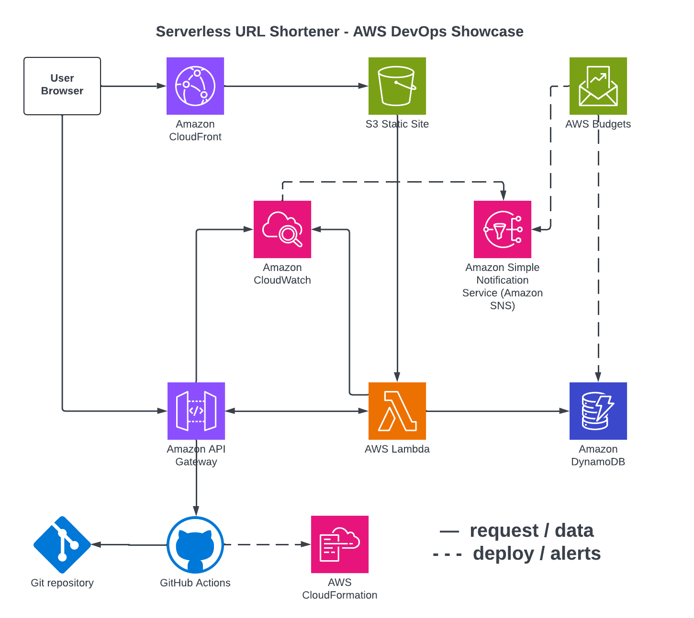

# Serverless URL Shortener – AWS Free-Tier DevOps Showcase

Fully serverless URL shortener that lives entirely in the AWS always-free tier, complete with CI/CD, monitoring, and budget guard-rails.

## High-Level Architecture

## Weekly Roadmap
- **Week 1** – design + cost guard-rails (current)
- Week 2 – infrastructure code (SAM / CloudFormation)
- Week 3 – CI/CD hardening
- Week 4 – observability & alarms
- Week 5 – UI polish + demo assets