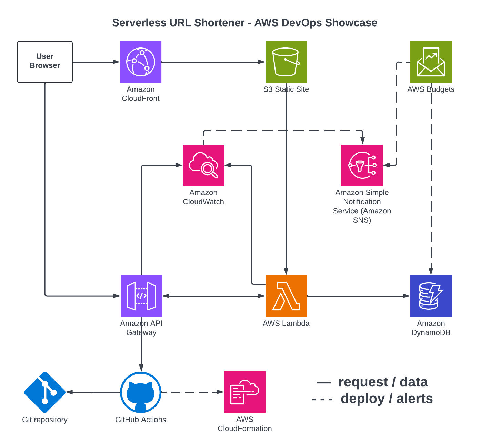

# 🚀 Serverless URL Shortener – AWS Free-Tier DevOps Showcase

A production-ready, fully serverless URL shortener built entirely within AWS free-tier limits. Features complete CI/CD automation, cost monitoring, and infrastructure-as-code deployment.

## 🏗️ Architecture Overview

This application demonstrates modern serverless architecture patterns:

- **API Gateway (HTTP API)** - Routes requests to Lambda functions
- **Lambda Functions** - Stateless compute for URL creation and redirection
- **DynamoDB** - NoSQL database storing slug-to-URL mappings
- **CloudWatch** - Monitoring, logging, and alerting
- **SNS** - Cost and error notifications
- **S3 Static Website** – Hosts the React-less vanilla HTML interface
- **CloudFront CDN** – Global edge caching for the static site
- **GitHub Actions** - Automated CI/CD pipeline with OIDC authentication



## 🎯 Key Features

### ✅ **Core Functionality**
- **Create short URLs** via `POST /api/slug` with JSON body `{"url": "https://long-url.com"}`
- **Redirect to original URLs** via `GET /{slug}` with HTTP 302 responses
- **Custom slug support** - optionally specify your own short code
- **Automatic slug generation** - 6-character random strings if no custom slug provided

### ✅ **Infrastructure & DevOps**
- **Infrastructure-as-Code** - Complete AWS resources defined in SAM template
- **Automated CI/CD** - GitHub Actions builds, tests, and deploys on every main branch push
- **Branch Protection** - PRs require passing checks before merge
- **OIDC Authentication** - Secure AWS access without storing credentials
- **Cost Monitoring** - AWS Budget alerts when spending exceeds $5/month
- **Error Monitoring** - CloudWatch alarms for Lambda errors and API 5XX responses
- **Static Frontend Deployment** – CI syncs `frontend/` to S3 and automatically invalidates CloudFront

### ✅ **Developer Experience**
- **Local Development** - SAM CLI for local testing and debugging
- **Hot Reload** - Changes reflect instantly during development
- **Comprehensive Testing** - Unit tests with pytest framework
- **Documentation** - Detailed setup and deployment guides

## 🛠️ Technology Stack

| Component | Technology | Free Tier Limit |
|-----------|------------|-----------------|
| **Compute** | AWS Lambda (Python 3.13) | 1M requests/month |
| **API** | API Gateway HTTP API | 1M calls/month |
| **Database** | DynamoDB On-Demand | 25GB storage |
| **Storage** | S3 (deployment artifacts) | 5GB storage |
| **Frontend** | S3 Static Website | 5GB storage |
| **CDN** | CloudFront | 1 TB data out |
| **Monitoring** | CloudWatch | 10 custom metrics |
| **CI/CD** | GitHub Actions | Unlimited minutes (public repos) |
| **Infrastructure** | AWS SAM + CloudFormation | Free |

## 📋 Prerequisites

Before you begin, ensure you have the following installed:

- **AWS CLI v2** - [Download here](https://awscli.amazonaws.com/AWSCLIV2.msi)
- **AWS SAM CLI** - [Download here](https://github.com/aws/aws-sam-cli/releases/latest)
- **Docker Desktop** - [Download here](https://www.docker.com/products/docker-desktop)
- **Git** - [Download here](https://git-scm.com/download/win)
- **Python 3.13** - [Download here](https://python.org)

## 🚀 Quick Start

### 1. Clone and Setup

```bash
git clone https://github.com/Amrzxk/Serverless-URL-Shortener-AWS.git
cd Serverless-URL-Shortener-AWS
```

### 2. Configure AWS Credentials

```bash
aws configure --profile url-shortener-dev
# Enter your Access Key ID, Secret Access Key, Region (us-east-1), and JSON output format
```

### 3. Local Development

```bash
cd src
sam build
sam local start-api
```

Test the API locally:
```bash
# Create a short URL
curl -X POST http://localhost:3000/api/slug \
  -H "Content-Type: application/json" \
  -d '{"url": "https://www.google.com"}'

# Follow the redirect
curl -v http://localhost:3000/{slug}
```

### 4. Deploy to AWS

```bash
sam deploy --guided --profile url-shortener-dev
```

The deployment will create all necessary AWS resources and output your live API URL.

## 🔧 Project Structure

```
Serverless-URL-Shortener-AWS/
├── .github/workflows/          # CI/CD pipeline configuration
│   └── ci.yml                 # GitHub Actions workflow
├── src/                       # Application source code
│   ├── create_slug/           # Lambda function for creating short URLs
│   │   └── app.py
│   ├── redirect/              # Lambda function for URL redirection
│   │   └── app.py
│   ├── tests/                 # Unit tests
│   │   └── unit/
│   ├── template.yaml          # SAM/CloudFormation template
│   └── samconfig.toml         # SAM deployment configuration
├── docs/                      # Documentation and diagrams
│   ├── architecture.png       # System architecture diagram
│   ├── design-decisions.md    # Technical decision records
│   └── runbook.md            # Operational procedures
└── README.md                 # This file
```

## 🔄 CI/CD Pipeline

The application uses a sophisticated CI/CD pipeline with the following stages:

### **Pull Request Workflow**
1. **Code Checkout** - Clones the repository
2. **Python Setup** - Installs Python 3.13 and dependencies
3. **SAM Build** - Packages Lambda functions and dependencies
4. **Unit Tests** - Runs pytest against the codebase
5. **Template Validation** - Validates SAM template syntax
6. **Branch Protection** - Blocks merge until all checks pass

### **Main Branch Deployment**
1. **OIDC Authentication** - Securely assumes AWS role without stored credentials
2. **Build & Package** - Creates deployment artifacts
3. **CloudFormation Deploy** - Updates AWS infrastructure
4. **API URL Output** - Displays the live endpoint URL

### **Security Features**
- **No Stored Secrets** - Uses GitHub OIDC for AWS authentication
- **Least Privilege** - IAM roles with minimal required permissions
- **Branch Protection** - Enforces code review and testing
- **Immutable Deployments** - Each deployment creates a new version

## 📊 Monitoring & Observability

### **Cost Monitoring**
- **AWS Budget** - Alerts when monthly spending exceeds $5
- **SNS Notifications** - Email alerts for cost threshold breaches
- **Free Tier Compliance** - All resources stay within free tier limits

### **Error Monitoring**
- **Lambda Error Alarms** - Alerts on any function errors
- **API Gateway 5XX Alarms** - Monitors API error rates
- **CloudWatch Logs** - Centralized logging for all components

### **Performance Monitoring**
- **Lambda Metrics** - Duration, memory usage, and invocation counts
- **API Gateway Metrics** - Request counts, latency, and error rates
- **DynamoDB Metrics** - Read/write capacity and throttling events

## 🧪 Testing Strategy

### **Unit Tests**
- **Lambda Function Tests** - Tests for both create and redirect functions
- **Error Handling** - Validates proper error responses
- **Edge Cases** - Tests for invalid inputs and missing data

### **Integration Tests**
- **API Endpoint Tests** - End-to-end API testing
- **Database Integration** - Tests DynamoDB read/write operations
- **Error Scenarios** - Tests system behavior under failure conditions

### **Local Testing**
```bash
cd src
pytest tests/unit/ -v
```

## 🔒 Security Considerations

### **Authentication & Authorization**
- **OIDC Integration** - Secure GitHub-to-AWS authentication
- **IAM Roles** - Least privilege access for deployment
- **API Security** - Public endpoints with rate limiting considerations

### **Data Protection**
- **DynamoDB Encryption** - Data encrypted at rest
- **HTTPS Only** - All API communications encrypted in transit
- **Input Validation** - Sanitized inputs to prevent injection attacks

### **Infrastructure Security**
- **VPC Isolation** - Lambda functions in private subnets (if needed)
- **Security Groups** - Network-level access controls
- **CloudTrail** - API call logging for audit purposes

## 📈 Performance & Scalability

### **Auto-Scaling**
- **Lambda Functions** - Automatically scale from 0 to thousands of concurrent executions
- **DynamoDB** - On-demand capacity for unpredictable workloads
- **API Gateway** - Handles traffic spikes automatically

### **Performance Optimizations**
- **Cold Start Mitigation** - Provisioned concurrency for critical functions
- **Caching** - API Gateway response caching for frequently accessed URLs
- **Connection Pooling** - Efficient DynamoDB connections

### **Free Tier Limits**
- **Lambda** - 1M requests/month, 400K GB-seconds
- **API Gateway** - 1M HTTP API calls/month
- **DynamoDB** - 25GB storage, 25 RCU/WCU
- **CloudWatch** - 10 custom metrics, 5GB logs

## 🚨 Troubleshooting

### **Common Issues**

**Local Development**
```bash
# Docker not running
docker run hello-world

# SAM build fails
sam build --use-container

# Port conflicts
sam local start-api --port 4000
```

**Deployment Issues**
```bash
# Check CloudFormation events
aws cloudformation describe-stack-events --stack-name url-shortener-dev

# Validate template
sam validate

# Check IAM permissions
aws sts get-caller-identity
```

**OIDC Authentication**
```bash
# Verify OIDC provider
aws iam list-open-id-connect-providers

# Check role trust policy
aws iam get-role --role-name GitHubActions-Deploy-Role
```

## 🤝 Contributing

1. **Fork the repository**
2. **Create a feature branch** (`git checkout -b feature/amazing-feature`)
3. **Make your changes** and add tests
4. **Run the test suite** (`pytest tests/`)
5. **Commit your changes** (`git commit -m 'feat: add amazing feature'`)
6. **Push to the branch** (`git push origin feature/amazing-feature`)
7. **Open a Pull Request**

## 📄 License

This project is licensed under the MIT License - see the [LICENSE](LICENSE) file for details.

## 🙏 Acknowledgments

- **AWS SAM** - Serverless Application Model framework
- **GitHub Actions** - CI/CD automation platform
- **AWS Free Tier** - Cloud resources for learning and development

---

**Built with ❤️ using AWS serverless technologies**
